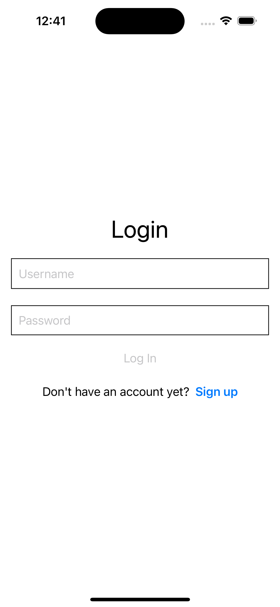
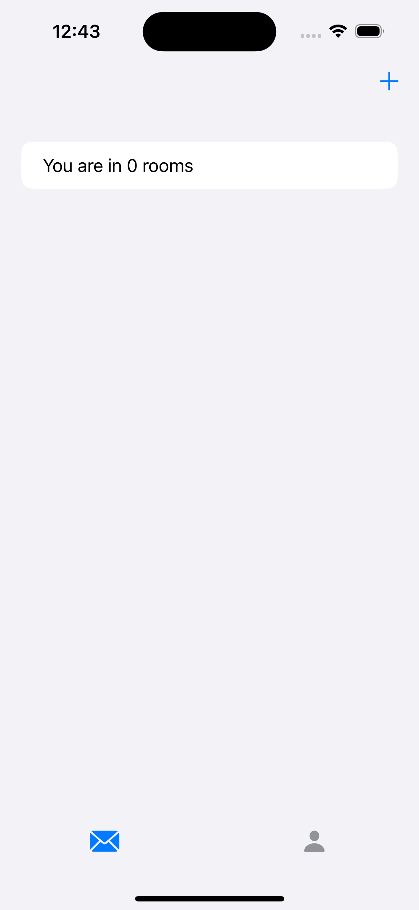
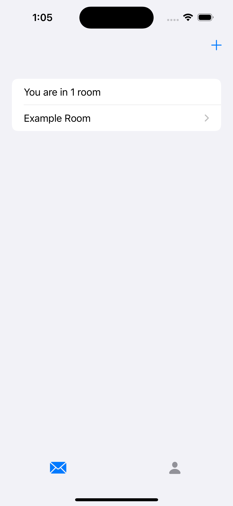
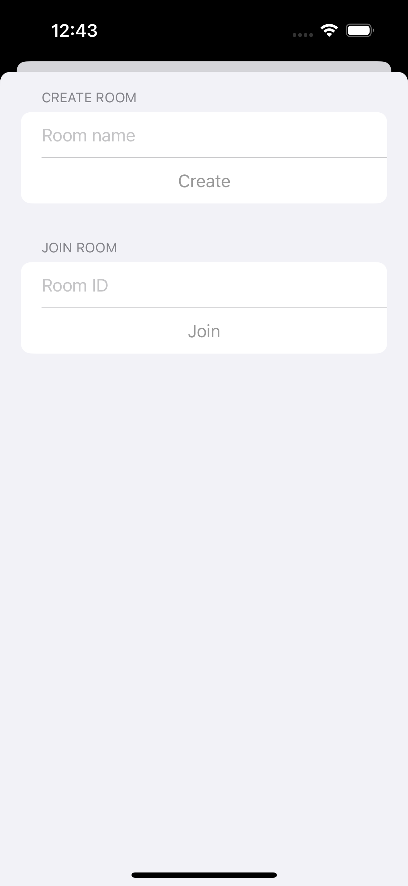
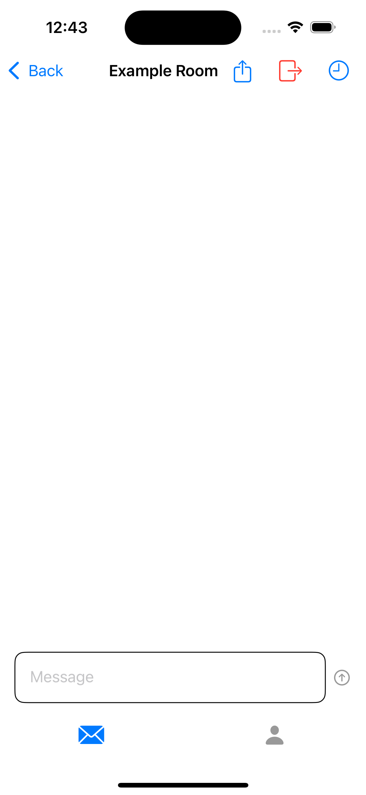
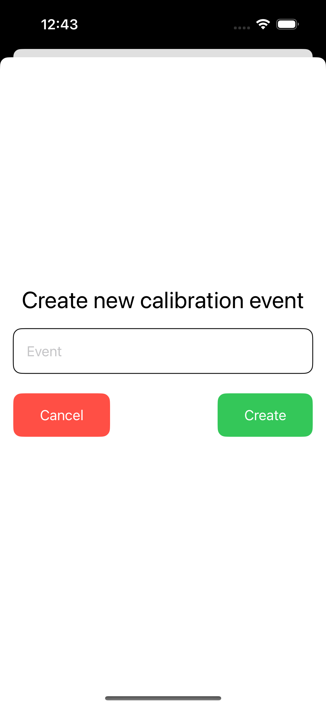
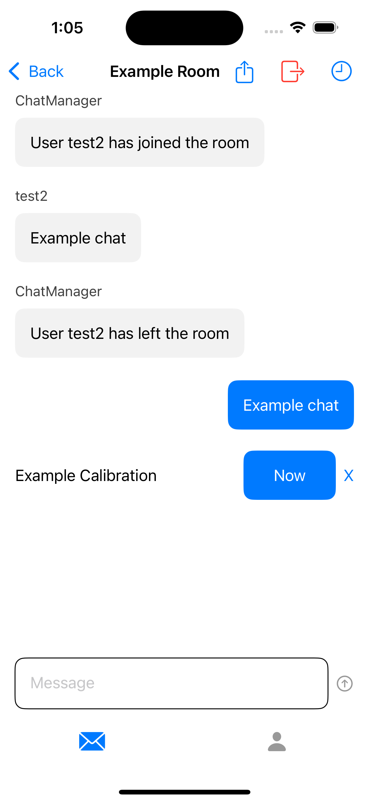

# GameChat
GameChat is an iOS app created to solve the problem of trying to communicate about a sports game to people who are watching elsewhere. In the days of streaming, everyone seems to be watching a different way. You can be ahead or behind the rest of the group. On a big play, you want to text your buddies about it, but if your stream is ahead of theirs, you'd spoil the play. When I've been watching on a stream that's behind, I only check the group's messages during commercials so as not to have any plays spoiled. To solve this, GameChat allows users to calibrate their devices so they only see messages about plays that have happened on their own stream. It also sorts the messages by when in the game they were sent so the users that are ahead will see the chronological by game time order of the messages. 

## Walkthrough 
Initially opening the app, users are asked to sign up/log in. 

  

After completing that, users will be on the [ChatPageView](Client/GameChat/GameChat/Views/Chat/ChatPageView.swift), which shows all the rooms a user is in. 

  
  

Users can click the plus in the top right of the screen to create or join a room on the [CreateOrJoinRoomView](Client/GameChat/GameChat/Views/CreateOrJoinRoomView.swift). 

  

Once a room is selected, users will see the [ChatView](Client/GameChat/GameChat/Views/Chat/ChatView.swift). In the top right of the screen, users have three options. The first option is to share the room, which allows user to share the room ID. The second option is to leave the room. And the third option is to create a calibration. 

  

If the user clicks on the create a calibration option, they will see the [CreateACalibrationView](Client/GameChat/GameChat/Views/Chat/CreateCalibrationView.swift), which gives them the option to create a calibration event. 

  

When a user joins or leaves the room, a message will be sent from ChatManager, informing the other users. 

  

## More on calibrations
A calibration event should be an event in the game such a kickoff, first pitch or the clock crossing the 10 minute mark. When a user creates a calibration event, all the other users in the room will see the calibration event in the chat. They can click X to ignore it, or click "Now" when the event happens on their stream. If no users are calibrated, the first user to calibrate is what all the other users are calibrated to. For example, if no users are calibrated and User 1 calibrates Event A at t = 2, User 1 will have a time difference of 0. If User 2 then calibrates Event A at t = 4, User 2 will have a time difference of 2. All chats from User 1 will show up on User 2's screen 2 seconds after User 1 sends them. If User 3 joins the room late and missed Event A, User 3 can create a new event, Event B. If User 3 calibrates Event B at t = 6, initially nothing will happen. A calibrated user needs to calibrate on Event B so that User 3 can be calibrated to User 1. If User 2 then calibrates Event B at t = 10, User 3 will have a time difference of -2, meaning any message User 3 sends will show up on User 1's screen after 2 seconds and User 2's screen after 4 seconds. 

A user's time difference won't change unless they leave the room and join again or they create a new calibration event. On joining a new room, the user's time difference will be set to 0. 
